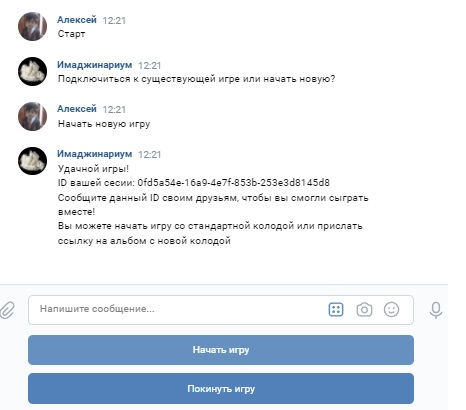
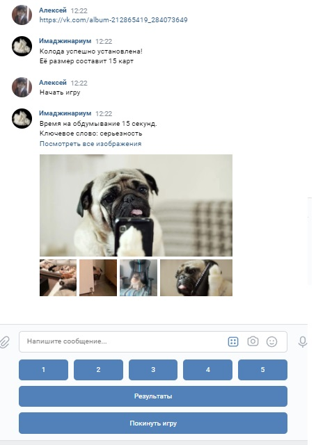
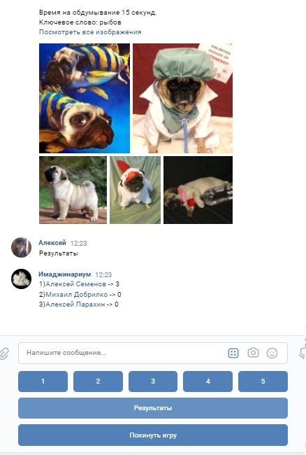
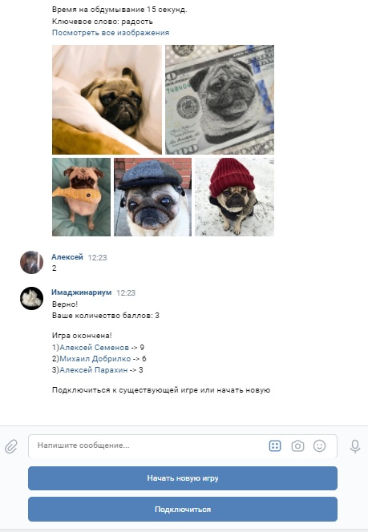

# Чат-боты

## Как запускать

Для корректной работы с VK API потребуется два токена: групповой токен и access токен. 
Гайды по их получению: 
- [групповой токен](https://dev.vk.com/api/bots/getting-started#%D0%9F%D0%BE%D0%BB%D1%83%D1%87%D0%B5%D0%BD%D0%B8%D0%B5%20%D0%BA%D0%BB%D1%8E%D1%87%D0%B0%20%D0%B4%D0%BE%D1%81%D1%82%D1%83%D0%BF%D0%B0)
- [access токен](https://www.pandoge.com/socialnye-seti-i-messendzhery/poluchenie-klyucha-dostupa-access_token-dlya-api-vkontakte)

В корне проекта создать файл `config.yaml` следующего вида:
```yaml
group_token: TOP_SECRET_TOKEN
secret: TOP_SECRET
```

Для запуска потребуется `go1.14`

### Запуск без сборки:
```bash
go run .
```

### Запуск со сброкой:
```bash
go build .
```
C последующим запуском бинарного файла

# Как пользоваться
Все существующие команды (часть из которых активна в разное время):
- [Старт](#старт)
- [Покинуть игру](#покинуть-игру)
- [Подключиться](#подключиться)
- [Начать новую игру](#начать-новую-игру)
- [Начать игру](#начать-игру)
- [Результаты](#результаты)

## Старт
Команда для начала взаимодействия с роботом. Активна в то время, когда игрок не находится в игровой сессии

## Покинуть игру
Покинуть текущую игровую сессию. Если игра не началась, а вы являетесь хостом сессии, то всех игроков автоматически отключит от текущей сессии

## Подключиться
Выводит список доступных игровых сессий. Активна в то время, когда игрок не находится в игровой сессии

## Начать новую игру
Создает новую игру. Игрок, создавший игру, становится хостом. Хост может выбрать колоду для игры, выслав ссылку на подходящий альбом ([пример](https://vk.com/album-212865419_284073649)), а также может начать игру

## Начать игру
Начинает игру. Возможность активировать данную команду есть только у хоста

## Результаты
Выводит результаты игроков

# Выполненные задачи

## 10
На сообщение «Старт» от пользователя выведите 5 случайных неповторяющихся и ещё не использованных изображений из колоды, отправьте их пользователю в одном сообщении.

Релиз: [v0.1.0](https://github.com/Not-cottage-cheese-but-cottage-cheese/Chat-Bots/tree/v0.1.0)

## 20 

Для каждого из изображений напишите несколько ключевых слов. Как и в задании за 10, выберите 5 случайных карт из колоды. Для выбранной пятёрки найдите ключевое слово, которое будет применимо только к одной из выбранных картинок. Отправьте это слово следующим после изображений карт. Попросите пользователя угадать, какая из карт соответствует ключевому слову. Если пользователь угадает — получит 3 балла. Если ошибётся — получит 0 баллов.

Релиз: [v0.2.0](https://github.com/Not-cottage-cheese-but-cottage-cheese/Chat-Bots/tree/v0.2.0)

## 30

Поддержите загрузку своего набора изображений. Если пользователь отправит вам ссылку на альбом с фотографиями ВКонтакте, переключайтесь на них как на колоду карт. Все слова в описании фотографии считайте описаниями карт.

Релиз: [v0.3.0](https://github.com/Not-cottage-cheese-but-cottage-cheese/Chat-Bots/tree/v0.3.0)

## 40

Поддержите мультиплеер! Приглашайте игроков регистрироваться на игру в личных сообщениях бота. Показывайте список ещё идущих игр — и приглашайте присоединиться к ним. На каждом круге предлагайте участникам одинаковый набор из пяти картинок и ключевое слово, подходящее к одной из них. Всем игрокам, правильно угадавшим загаданное изображение, начисляется по 3 балла. А по команде «результаты» показывайте текущее количество набранных всеми игроками баллов.

Релиз: [v0.3.0](https://github.com/Not-cottage-cheese-but-cottage-cheese/Chat-Bots/tree/v0.3.0)

# Пример работы




